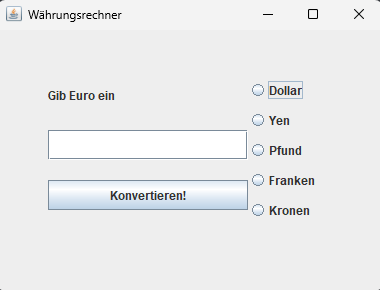

# Währungsrechner

Kleines Java-Konsolenprogramm zum Umrechnen von Beträgen zwischen verschiedenen Währungen.

## Screenshot

## Funktionen

- Eingabe eines Betrags über die Konsole
- Auswahl von Ausgangs- und Zielwährung
- Ausgabe des umgerechneten Betrags

## Thema / Übung

- Scanner-Eingaben
- Datentypen und einfache Berechnungen
- Konsolenausgabe

## Starten

Voraussetzungen:
- Java (JDK) ist installiert.

Kompilieren und starten (aus dem Projektordner):

Oder direkt in der IDE (z.B. VS Code) die `main`-Methode der Klasse `Waerungsrechner` ausführen.