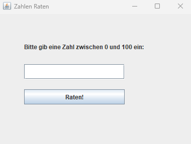

# Zahlen raten

Kleines Java-Konsolenspiel: Der Computer wählt eine Zufallszahl, der Spieler muss sie erraten.

## Screenshot

## Funktionen

- Generiert eine Zufallszahl in einem bestimmten Bereich
- Nutzer gibt Versuche über die Konsole ein
- Hinweise: „zu hoch“ / „zu niedrig“
- Am Ende Anzeige, nach wie vielen Versuchen richtig geraten wurde

## Thema / Übung

- Schleifen und Bedingungen
- Zufallszahlen (`Math.random` oder `Random`)
- Scanner-Eingaben

## Starten

Voraussetzungen:
- Java (JDK) ist installiert.

Kompilieren und starten (aus dem Projektordner):

Oder direkt in der IDE (z.B. VS Code) die `main`-Methode der Klasse `Waerungsrechner` ausführen.
